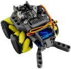
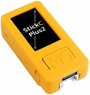
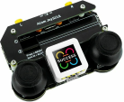

# RoverC Mecanum wheel omnidirectional mobile robot

This software allows you to control an M5Stack RoverC Mecanum wheel robot with the M5Stack AtomJoyStick.

## What you'll need

To make this project you'll need:

1. An [M5Stack RoverC](https://shop.m5stack.com/products/roverc-prow-o-m5stickc). 

2. An [M5StickC controller](https://shop.m5stack.com/collections/m5-controllers/STICK), either an M5StickC, an M5StickC PLUS, or an M5StickC PLUS2. 

3. An [M5Stack AtomJoyStick](https://shop.m5stack.com/products/atom-joystick-with-m5atoms3). 

## Pairing the Rover with the joystick

To use the joystick, you will need to pair it with the Rover. To do this:

1. Turn on the joystick while pressing down on the screen (you should hear a click when you do this)
2. When you release the screen it should say: "Press to **Pair**"
3. Press the screen again, the joystick should start beeping and say: "Press the **Button** of AtomFly"
4. Turn on the M5Stick on the Rover and press the **B** button (the one on the side that is not the power button)
5. The joystick should briefly display "Success" and then will reboot
6. The Rover will display the values received from the joystick on its screen

Once you have paired the joystick, you will not need to to it again (unless you pair the joystick with something else).

You can now switch on the Rover base and use the joystick to control it.

## Controlling the Rover

### Mecanum mode

By default the Rover works in **Mecanum mode**:

1. The **right joystick** controls movement
    1. Moving the joystick left or right moves the Rover left or right
    2. Moving the joystick forward or backward moves the Rover forward or backward
    3. Moving the joystick diagonally moves the Rover diagonally
2. The **left joystick** controls rotation
    1. Moving the joystick to the right rotates the Rover clockwise
    2. Moving the joystick to the left rotates the Rover anti-clockwise.
3. The joysticks may be used at the same time so the Rover rotates while it moves
4. If the claw is attached, then moving the left joystick forward and backward will open and close the claw

### Tank mode

Clicking the left button on the joystick turns tank mode on and off. In **tank mode**:

1. Moving the **right joystick** forward or backward causes both the right side wheels to move forward or backward
2. Moving the **left joystick** forward or backward causes both the left side wheels to move forward or backward
3. If the claw is attached, then moving the left **joystick** left or right opens and closes the claw
